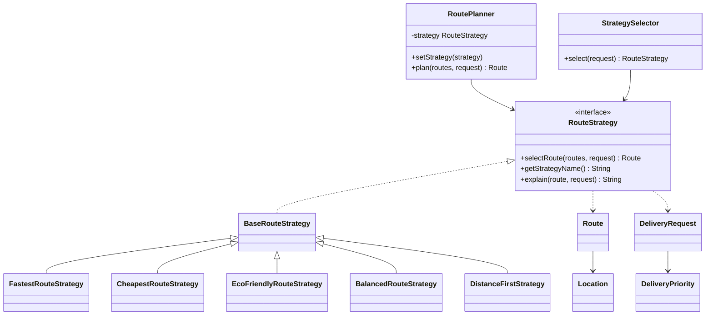

# UML Class Diagram

```mermaid
classDiagram
    class RouteStrategy {
        <<interface>>
        +selectRoute(routes, request) Route
        +getStrategyName() String
        +explain(route, request) String
    }
    class BaseRouteStrategy
    class RoutePlanner {
        -strategy RouteStrategy
        +setStrategy(strategy)
        +plan(routes, request) Route
    }
    class StrategySelector {
        +select(request) RouteStrategy
    }
    class FastestRouteStrategy
    class CheapestRouteStrategy
    class EcoFriendlyRouteStrategy
    class BalancedRouteStrategy
    class DistanceFirstStrategy
    class Route
    class Location
    class DeliveryRequest
    class DeliveryPriority
    RouteStrategy <|.. BaseRouteStrategy
    BaseRouteStrategy <|-- FastestRouteStrategy
    BaseRouteStrategy <|-- CheapestRouteStrategy
    BaseRouteStrategy <|-- EcoFriendlyRouteStrategy
    BaseRouteStrategy <|-- BalancedRouteStrategy
    BaseRouteStrategy <|-- DistanceFirstStrategy
    RoutePlanner --> RouteStrategy
    StrategySelector --> RouteStrategy
    Route --> Location
    DeliveryRequest --> DeliveryPriority
    RouteStrategy ..> Route
    RouteStrategy ..> DeliveryRequest
```
