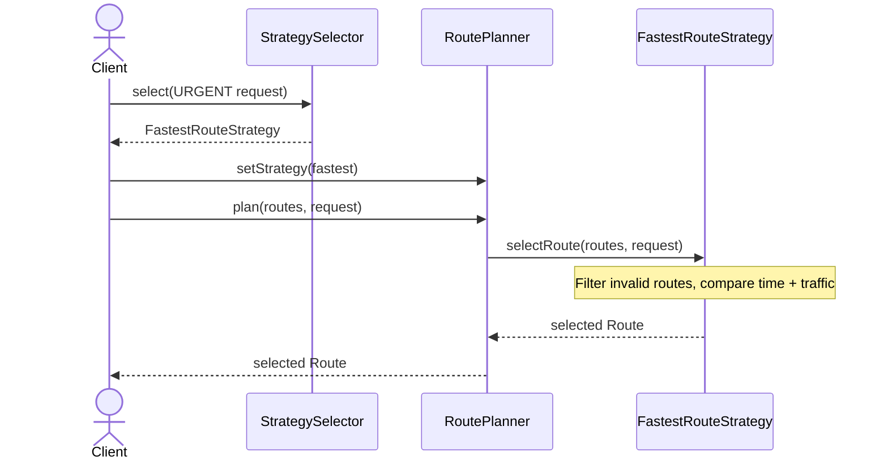

# UML Sequence Diagram

```mermaid
sequenceDiagram
    actor Client
    participant Selector as StrategySelector
    participant Planner as RoutePlanner
    participant Strategy as FastestRouteStrategy
    Client->>Selector: select(URGENT request)
    Selector-->>Client: FastestRouteStrategy
    Client->>Planner: setStrategy(fastest)
    Client->>Planner: plan(routes, request)
    Planner->>Strategy: selectRoute(routes, request)
    Note over Strategy: Filter invalid routes, compare time + traffic
    Strategy-->>Planner: selected Route
    Planner-->>Client: selected Route
```
